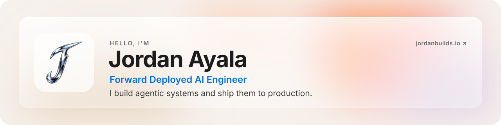
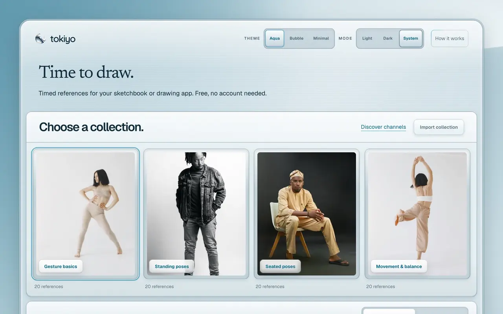
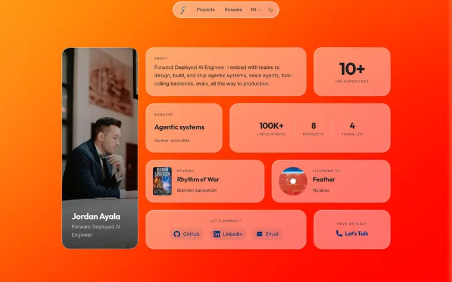

<a href="https://jordanbuilds.io">
  <picture>
    <source media="(prefers-color-scheme: dark)" srcset="./assets/banner-dark.svg">
    <source media="(prefers-color-scheme: light)" srcset="./assets/banner-light.svg">
    
  </picture>
</a>

  
  
  
  

I'm a forward deployed AI engineer with 10+ years in software. I build agentic systems, from real-time voice agents to the tool-calling backends behind them, and ship them to production alongside the teams that run them. Before that I led engineering teams, shipped mobile apps, and built ML systems for healthcare and logistics.

### Right now

- **At [Saywise](https://saywise.com)**, building conversational AI agents: real-time streaming pipelines, voice (OpenAI, ElevenLabs, Deepgram), and infrastructure that keeps responses under a second.
- **On the side**, running [Tokiyo](https://tokiyo.jordanbuilds.io), a free timer for figure-drawing practice.
- **Ask me about** agentic systems, voice agents, evals, or getting an AI prototype into production.

### Things I've built

<table>
  <tr>
    <td width="50%" valign="top">
      <a href="https://tokiyo.jordanbuilds.io">
        <picture>
          <source media="(prefers-color-scheme: dark)" srcset="./assets/tokiyo-dark.webp">
          
        </picture>
      </a>
      <h4><a href="https://tokiyo.jordanbuilds.io">Tokiyo</a></h4>
      
Timed photo references for figure drawing. Pick a set of poses, or bring your own from Are.na or Cosmos, and draw while Tokiyo keeps time. Free, no account.

      
<b>Next.js · React · TypeScript · Tailwind · Are.na API</b>

    </td>
    <td width="50%" valign="top">
      <a href="https://jordanbuilds.io">
        <picture>
          <source media="(prefers-color-scheme: dark)" srcset="./assets/portfolio-dark.webp">
          
        </picture>
      </a>
      <h4><a href="https://jordanbuilds.io">jordanbuilds.io</a></h4>
      
My portfolio: a static bento site in six languages, with frosted glass over a GPU-gated WebGL shader. It scores 99+ on mobile Lighthouse.

      
<b>Astro · Tailwind · three.js · Cloudflare Pages · Playwright</b>

    </td>
  </tr>
</table>

### Open source

<table>
  <tr>
    <td width="50%" valign="top">
      <h4><a href="https://github.com/jmayalag/seer">seer</a></h4>
      
An R package and research scripts that train machine-learning models to predict price direction in the Forex market, then backtest hybrid strategies that combine them with technical analysis.

      
<b>R</b> · <a href="https://github.com/jmayalag/OHLCMerge">Companion: OHLCMerge</a>

    </td>
    <td width="50%" valign="top">
      <h4><a href="https://github.com/uamericana/PINV18_846-Experiments">PINV18-846 Experiments</a></h4>
      
Research code from Universidad Americana for detecting diabetic retinopathy in eye-fundus images. It fine-tunes ResNet, Xception and MobileNet with TensorFlow and uses an evolutionary algorithm (DEAP) to search their hyperparameters.

      
<b>Python · TensorFlow</b>

    </td>
  </tr>
</table>

### Toolbox

| Area | Tools |
| :-- | :-- |
| **AI & ML** | Python · FastAPI · Keras · OpenAI · ElevenLabs · Deepgram |
| **Web** | TypeScript · React · Next.js · Astro · Tailwind CSS |
| **Mobile** | React Native · Kotlin · Android · Firebase |
| **Data & infra** | Kafka · BigQuery · Google Cloud · Cloudflare |

<b>The path so far</b>

 

| When | Role | Where |
| :-- | :-- | :-- |
| 2024⁠–⁠now | AI Software Engineer | Saywise |
| 2022⁠–⁠2024 | Technical Lead, a team of 10 on a multi-warehouse platform | BairesDev |
| 2021⁠–⁠2022 | Senior Mobile Engineer, an NFT marketplace on EOS | Voice |
| 2020⁠–⁠2022 | Data Scientist, ML for diabetic retinopathy and healthy recipes | Universidad Americana · CONACYT |
| 2019⁠–⁠2022 | Lead Mobile Engineer, iOS and Android food ordering | Luke's Local |
| 2019⁠–⁠2021 | Android Team Lead | SweatWorks |
| 2015⁠–⁠2019 | Full-stack, IT and mobile consulting | Multisoft · Konecta · Freelance |

Computer Software Engineering, Universidad Nacional de Asunción. My thesis on intelligent stock trading systems was published in a peer-reviewed journal. 
Full details are on my [resume](https://jordanbuilds.io/resume).

Ship fast, learn faster.

